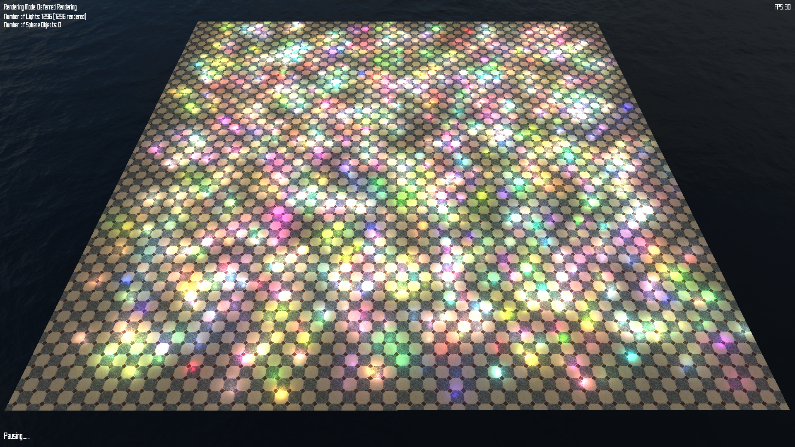
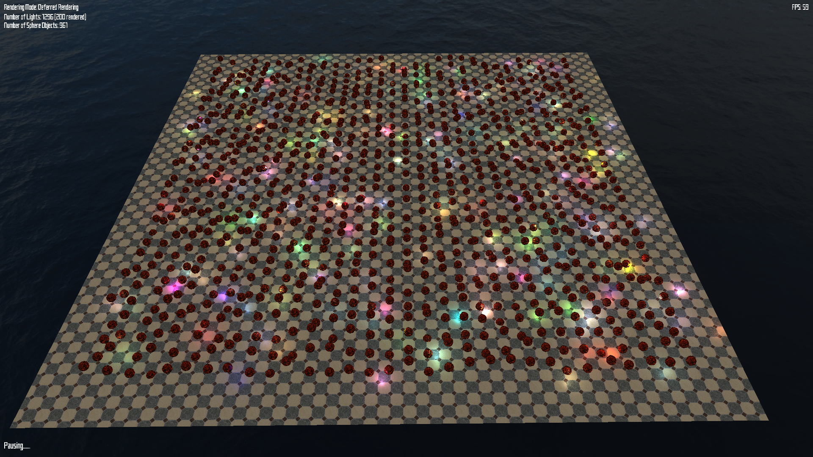
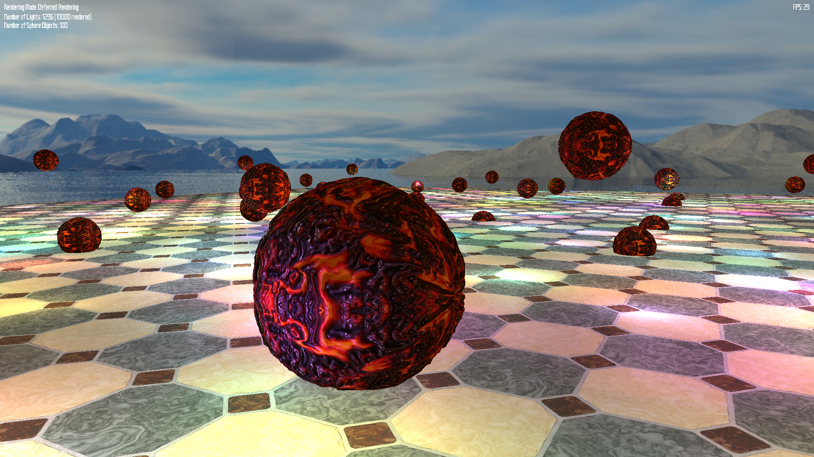

# Deferred Rendering in OpenGL

This is a program to implement Deferred Rendering in OpenGL.

This program is developed mainly for the couse CSci 5608 Fundamentals of Computer Graphics at UMN.

## Gallery

[Video Demo](https://youtu.be/vnI9MxYbbZM)

  
## Usage

    mkdir build
    cd build
    cmake ..
    make

    ./benchmark
    
### Dependencies
+ OpenGL 4.2+
+ GLM
+ GLFW 3.2
+ OpenMP
+ FreeType
+ stbi\_image (included already)

### Configuration

  Line 5-22 in `CMakeLists.txt`

## Control

+ `w`, `s`, `a`, `d`: move
+ `q`, `e`, `mouse`: turn camera around
+ `b`: reset the locaiont of camera
+ `f`: fullscreen
+ `p`: pause
+ `esc`: quit
+ `o`: enable/disable rendering sphereical objects
+ `l`: show/hide light source positions
+ `m`: switch between forward and deferred rendering
+ `n`: switch framebuffer content in deferred rendering mode
+ `up`, `down`: increase/decrease number of light sources

